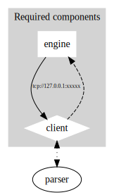

# Client-Server Communication Protocol

Squiid is unique in that the part that actually does the calculations (the engine) is completely seperate from the part that the user sees (the frontend). The main thing that makes Squiid Squiid is the engine, and the program was designed with this in mind. While we do provide our own parser and frontend(s), developers do not need to use these and can create their own parsers and frontends with the features that they would like. However, this is not required if you would like a feature to be included in Squiid, and you can simply [submit an issue]() or a [merge request]() <!-- TODO: --> that adds or requests the addition of the feature you would like. 

## Network flow

The network flow is detailed in the diagram below. You can see that the parser is outside of the "required components" cluster, as you have three options for parsing:

1. Build our [Rust-based parser](https://gitlab.com/ImaginaryInfinity/squiid-calculator/squiid-parser) as a shared object file and use this parser in your frontend, as is detailed in the diagram
2. Build your own parser in the language of your choice and use that as seen in the diagram
3. Build your own parser into your frontend program, completely eliminating the need to use and call a separate shared object file.

Note that a parser is **NOT** required if your frontend only supports entering calculations in reverse polish notation, or postfix notation. More documentation on building a parser can be found <!-- TODO: --> [here](). 

After you choose how you would like to parse user input, you must build your frontend. This is completely up to you except for one constraining factor, the IPC communication library. We use nanomsg for IPC between the frontend and the engine, and at the time of writing this documentation, the available language bindings can be found [here](https://nanomsg.org/documentation.html). Many popular languages are currently supported such as Rust, Python, Java, JavaScript, C, and many others. Make sure that the language you are implementing the frontend in has nanomsg bindings. Other than this constraint, the frontend is entirely up to you. You can make a GUI, a TUI, or any other abomination of a user interface that you can think of.

Once the frontend is set up, it is fairly easy to communicate with the backend server. Examples for Rust and Python can be found <!-- TODO: --> [here](). The following steps will detail how to connect to the server.

1. If your language of choice can import and use a Rust shared object (.so) file, follow substep 1, if not, follow substep 2.
    1. You CAN import and use a shared object file: [download]() or compile from source the engine shared object file (`libsquiid_engine.so`). Now, include/import this shared object file and construct a thread to call the `start_server` function. This function accepts one argument, which is the address the server should attempt to bind to. The official Squiid frontend finds an open TCP port in the range 20,000-30,000 and binds the server to `tcp://127.0.0.1:xxxxx`, with `xxxxx` being the open port that was found.
    2. You CANNOT import and use a shared object file: [download]() or compile from source the engine binary file (`squiid_engine_bin`). Then, construct a thread which will call the executable. Rust users should use `std::process::Command`, Python users should use `subprocess`, etc. The engine binary accepts one command-line argument, which is the address the server should attempt to bind to. The official Squiid frontend finds an open TCP port in the range 20,000-30,000 and binds the server to `tcp://127.0.0.1:xxxxx`, with `xxxxx` being the open port that was found.
 2. Now that you have started the server in it's thread, it should be listening. The official Squiid client had to put in a 10 millisecond delay after starting the server to wait for it to bind, or else sometimes it wouldn't bind quick enough and the program would crash. This is not a required step but it is recommended.
 3. In order to connect with the server, you must dial the address that you just gave the engine. Using the nanomsg bindings for your programming language of choice, construct a socket object with the `Req` protocol (this may be different depending on the binding, such as `Req0` for Python). Now, call the dial method on this socket and pass it the address that you gave the server. If there is a way to check if this function returns correctly without an error, you should do so (e.g. `assert!()` in Rust).
 4. Great! Now that you are connected with the server, you can use the `send` (or similar) method on the socket to send data to the server, and the `recv` (or similar) to recieve data from the server. The protocol for sending and receiving data is outlined below. The backend server is currently blocking, not async, however you should be able to start multiple instances on different ports and have it work fine if this suits your needs. 



<!-- graphviz source:
digraph G {
    
    subgraph cluster_required {
        label="Required components"
        style=filled;
		color=lightgrey;
		node [style=filled,color=white];
        engine [shape=box]
        client [shape=diamond]
        client -> engine [style=dashed]
        engine -> client [label="tcp://127.0.0.1:xxxxx" fontsize="8" ]
    }
    
    parser
    client -> parser [dir=both style=dotted]
    
} -->

<!-- mermaid code:

flowchart TD

subgraph "Required components";

engine[(Engine)]-.Rep.->client([Client]);
client--Req--\>engine;

caption(tcp://127.0.0.1:xxxxx)

end;

client <-."Shared Object".-> parser([Parser]);
 -->

## Data Transmission Protocol

The transmission protocol for sending and receiving data to and from the engine is fairly simple, as it is just JSON. A simple data structure that you could send might look something like this:

```json
{
    "transmission_type": "eval",
    "payload": "add"
}
```

Something that you might get back from the server could look like this:

```json
{
    "response_type": "stack",
    "payload": [
        "1",
        "2",
        "3"
    ]
}
```

| Transmission Type | Payload                               |
| ----------------- | ------------------------------------- |
| eval              | String of RPN calculation to evaluate |
| command           | Command to execute                    |

| Response Type | Payload                                                            |
| ------------- | ------------------------------------------------------------------ |
| stack         | A list of every item in the stack                                  |
| error         | A string containing an error message                               |
| commands      | A list of every command                                            |
| quitsig       | None. This is a confirmation that the server has successfully quit |